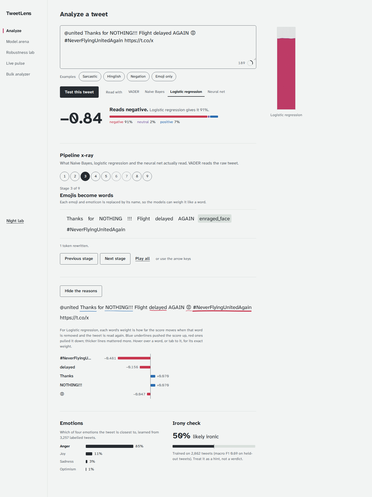
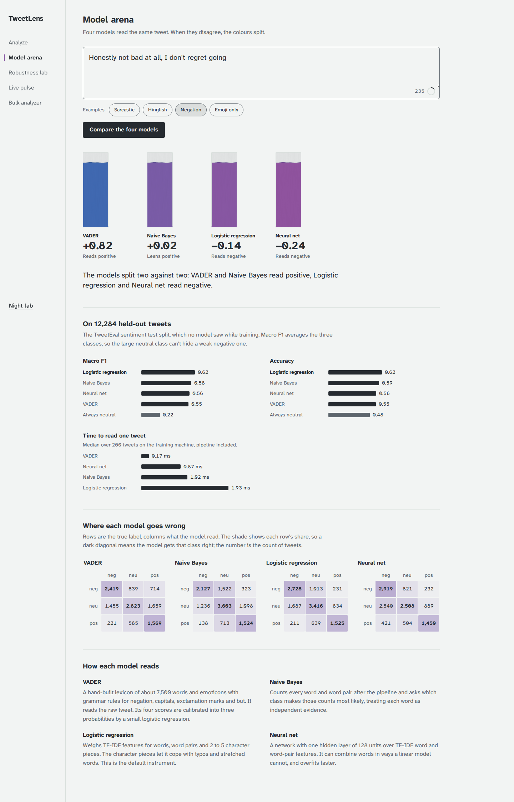
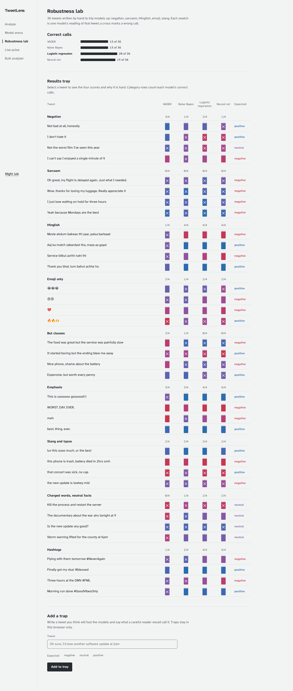
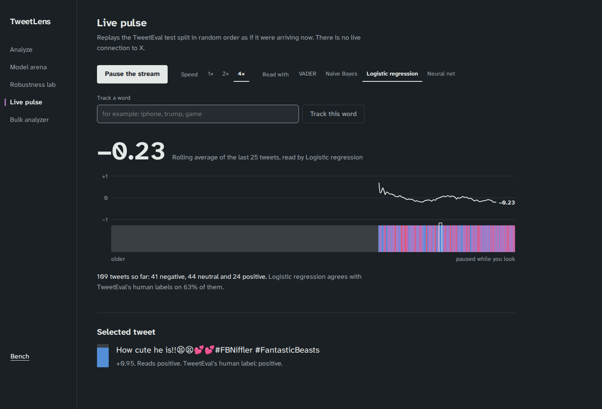
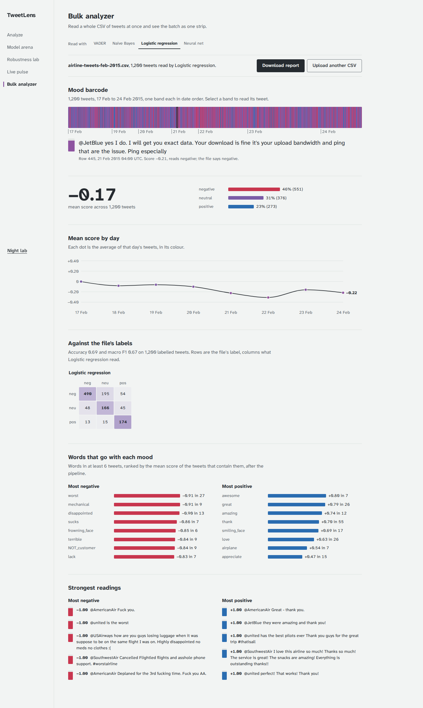
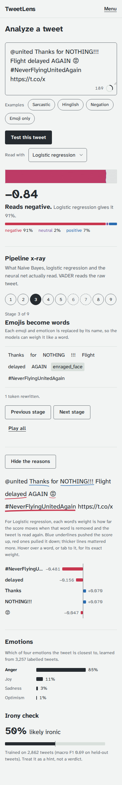
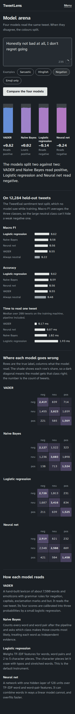

# TweetLens

A litmus test for tweets. Each tweet is dipped like litmus paper and changes colour: acid red for negative, violet
for neutral, alkaline blue for positive. Behind the strip are four sentiment models you can compare, a step-by-step
view of what they actually read, and the words that swayed them.



## What's inside

| Page | What it does |
| --- | --- |
| **Analyze** | Type or paste a tweet. The strip wicks up to its colour, and the score (P(positive) − P(negative), from −1 to +1) appears beside it. It reads as you type. Underneath: the **Pipeline X-Ray**, which steps through the nine stages that turn the tweet into model input; **Why this prediction?**, which underlines the words that pushed the score up or down; and emotion and irony readings. |
| **Model arena** | Four strips, one per model, dipped in the same tweet. One sentence names the outlier. Below are benchmark scores on 12,284 held-out tweets, confusion matrices, and latency. |
| **Robustness lab** | 36 hand-written trick tweets (negation, sarcasm, Hinglish, emoji only, but-clauses, slang, hashtags…) in a results tray of strip swatches, with a cross on every wrong call. You can add your own traps. |
| **Live pulse** | A chart-recorder ribbon fed by server-sent events: every tweet adds a 3px band, and a rolling average is drawn above. It replays the TweetEval test split; there is no live X connection, and the page says so. |
| **Bulk analyzer** | Upload a CSV and see the whole batch as a mood barcode, with a daily timeline, an error matrix if the file has labels, and the words that go with each mood. Then download a report. The sample is 1,200 real airline tweets from February 2015. |

<table>
  <tr>
    <td></td>
    <td></td>
  </tr>
  <tr>
    <td></td>
    <td></td>
  </tr>
</table>

## The models

All four sentiment models are trained in this repository on the TweetEval sentiment training split (45,615 tweets,
SemEval-2017 Task 4A) and scored on its 12,284-tweet test split, which none of them saw during training.
Hyperparameters were picked on the validation split.

| Model | Accuracy | Macro F1 | Macro recall | Time per tweet |
| --- | --- | --- | --- | --- |
| VADER (lexicon and rules, calibrated) | 0.554 | 0.550 | 0.582 | 0.17 ms |
| Naive Bayes (word and word-pair counts) | 0.591 | 0.585 | 0.595 | 1.02 ms |
| **Logistic regression** (TF-IDF words + 2–5 character pieces) | **0.624** | **0.623** | **0.635** | 1.93 ms |
| Neural net (one hidden layer, 128 units) | 0.560 | 0.564 | 0.589 | 0.87 ms |
| Always answering "neutral" | 0.483 | 0.217 | 0.333 | n/a |

For context, the TweetEval paper reports 62.9 macro recall for its SVM and FastText baselines on this test split;
logistic regression here reaches 63.5. Its fine-tuned RoBERTa models score above 71. Times are medians over 200 tweets on the training
machine, pipeline included.

Two more readers use the same pipeline: **emotions** (anger, joy, optimism, sadness; macro F1 0.68, from 3,257 tweets)
and **irony** (macro F1 0.69, from 2,862 tweets). The irony reader is shown as a hint, never a verdict. On the
robustness suite, every model gets all four sarcastic tweets wrong, but the irony reader flags them.

**Why this prediction?** uses leave-one-out: a word's weight is how far the score moves when that word is removed and
the tweet is read again. It works the same way for all four models.

### The pipeline

What Naive Bayes, logistic regression, the neural net and the emotion and irony readers see. VADER reads the raw
tweet.

1. Raw tweet, split into tokens (URLs, mentions, hashtags, emoji and emoticons kept whole)
2. Links, @mentions and retweet marks removed
3. Emojis and emoticons become words (`😡` → `enraged_face`, `:(` → `frowning_face`)
4. Hashtags split apart (`#NeverFlyingUnitedAgain` → never flying united again)
5. Lowercased; stretched words squeezed (`soooo` → `soo`)
6. Contractions expanded (`don't` → do not, `dont` → do not)
7. Hinglish words translated (`bakwas` → rubbish, `nahi` → not)
8. Negation fused (`not happy` → `NOT_happy`). Hindi's *nahi* comes after the word it negates, so it fuses backwards:
   `achhi nahi` → `NOT_good`
9. Stopwords and most punctuation removed (`!` and `?` stay)

Every stage records which tokens were removed, rewritten, split or fused, and the X-Ray animates exactly that.

## Run it

You need Python 3.11+ and Node 20.19+ (or 22.12+).

```sh
make setup   # virtualenv, npm install, download TweetEval, train every model (about 3 minutes)
make dev     # API on :8000 and the web app on http://localhost:5173
```

To run it as one process, the way you would deploy it:

```sh
make serve   # builds the web app; FastAPI serves it and the API on http://localhost:8000
```

Other commands:

```sh
make test         # backend pytest + frontend vitest
make train        # retrain the models
make screenshots  # every page at 1440px and 390px in both themes (needs the app running)
```

## Project layout

```
backend/
  tweetlens/
    preprocess.py        the nine-stage pipeline, with a token-level trace
    train.py             trains and scores every model, writes artifacts/metrics.json
    models.py            loads the models, reads tweets, explains readings
    api.py               FastAPI: analyze, explain, robustness, pulse (SSE), bulk, meta
    bulk.py, pulse.py    CSV reading and the replayed stream
    robustness_suite.json
  tests/
frontend/
  src/
    components/          LitmusStrip, PipelineXRay, WhyPanel, Ribbon, Barcode, charts…
    pages/               one file per page
    lib/                 tokens, OKLCH colour ramp, API client, theme, state
  scripts/screenshots.mjs
DESIGN.md                the design contract: tokens, contrast, wireframes, motion plan
```

## Design

The interface follows [DESIGN.md](DESIGN.md): one signature element (the strip), a seven-colour palette with
contrast measured for every text and background pair, Atkinson Hyperlegible Next throughout, motion only in answer to
what you do, and `prefers-reduced-motion` respected everywhere. There are two themes, Bench and Night lab.




## Limits

- These are classical models. They miss sarcasm almost entirely, and they learned from English tweets collected for
  SemEval between 2013 and 2017.
- The Hinglish stage is a lexicon of 58 words and 4 negators, not a translation model.
- Live pulse replays a fixed test set. Connecting to the X API would need a paid key.
- The Robustness lab's expected labels are one careful reader's judgement.

## Data and credits

- **TweetEval**: Barbieri et al., *TweetEval: Unified Benchmark and Comparative Evaluation for Tweet
  Classification*, Findings of EMNLP 2020. Downloaded from
  [cardiffnlp/tweeteval](https://github.com/cardiffnlp/tweeteval) by `make setup`; not stored in this repository.
- **Bulk sample**: 1,200 tweets from the Twitter US Airline Sentiment dataset (Figure Eight, 2015), CC BY-NC-SA 4.0,
  in `frontend/public/samples/`. Built by `backend/scripts/make_bulk_sample.py`, which drops user names.
- **VADER**: Hutto and Gilbert, ICWSM 2014 (MIT licence).
- **Atkinson Hyperlegible Next**: the Braille Institute (SIL Open Font License), self-hosted through Fontsource.
